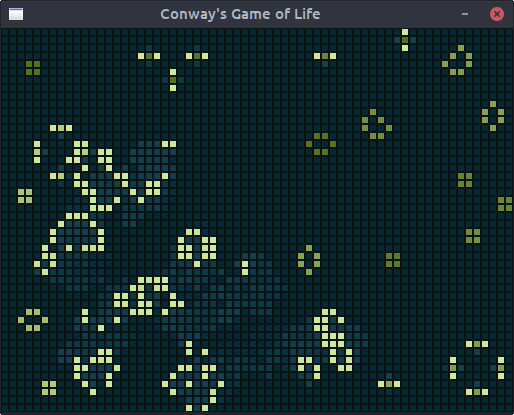

# Conway's Game of Life Engine in Go

Simple game engine for Conway's Game of Life. The engine is a standalone package and the front-end is written the Go SDL2 bindings. There is also a command line client.

